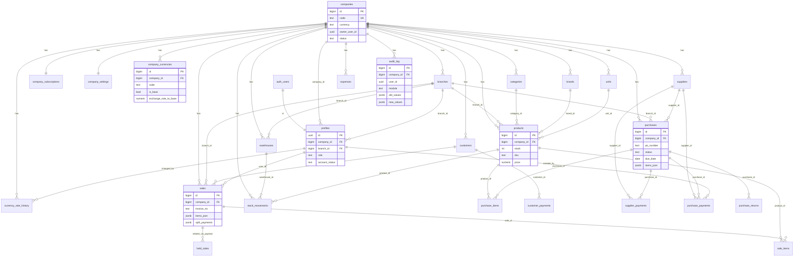

# Nexora POS — Database Architecture Review

**Date:** 2026-07-22  
**Scope:** Read-only analysis of `supabase/migrations/001` → `013` plus light cross-check of `api/_posData.js`  
**Status:** Review / recommendations only — **no production changes, no migrations applied, no schema files modified**

---

## 1. Executive summary

Nexora POS evolved from a **single-tenant retail POS schema** (migration `001`) into a **multi-tenant SaaS data plane** (`004`/`005`) with enterprise purchases, FX, and user-management columns layered on top (`007`–`013`). The final state is **usable for production POS** but **not yet enterprise-normalized**: tenancy is bolted on (`company_id` often nullable), RLS on legacy tables is **role-based without tenant predicates**, line items are **duplicated as JSON + relational rows**, and several app-expected columns/tables are **missing or inconsistently modeled**.

**Verdict:** Architecture is **adequate for a service-role API gate** (current app pattern) but **fails enterprise multi-tenant standards** if the Supabase `authenticated` key is ever used client-side against tables directly. Highest risks are cross-tenant RLS gaps, dual write paths for sales/purchases lines, denormalized inventory on `products.stock`, and subscription/settings duplication.

---

## 2. Current architecture overview

### 2.1 Migration chain (final inferred state)

| # | File | Effect |
|---|------|--------|
| 001 | `001_nexora_schema.sql` | Core POS tables, helpers, RLS (role-based), seed data |
| 002 | `002_rls_hardening_notes.sql` | Revoke `anon`, grant `authenticated`, default privileges |
| 003 | `003_invoice_verifications.sql` | Public invoice QR registry + open SELECT policy |
| 004 | `004_production_data_plane.sql` | `companies`, tenant tables, JWT helpers, `pos_create_sale`, company-scoped RLS for new tables |
| 005 | `005_ensure_full_production_schema.sql` | **Bootstrap duplicate** of 001+003+004 + patches/indexes/policy refresh |
| 006 | `006_remove_demo_products.sql` | Deactivate demo products |
| 007 | `007_purchase_workflow_fields.sql` | Supplier/product PO fields (`sku`, `tax_rate`, etc.) |
| 008 | `008_purchase_rbac_receive.sql` | `is_owner_or_admin` + permissions seed for purchase approve |
| 009 | `009_suppliers_purchases_enterprise.sql` | Supplier codes, PO payments, partial receive, `supplier_ledger_v` |
| 010 | `010_purchase_due_dates.sql` | `purchases.due_date`, `payment_terms` |
| 011 | `011_enterprise_users_management.sql` | Profile lifecycle + audit enrichment + subscription display cols |
| 012 | `012_enterprise_multi_currency.sql` | `company_currencies`, `currency_rate_history`, FX columns |
| 013 | `013_performance_indexes.sql` | Composite `(company_id, …)` indexes |

**Note:** `005` is a re-runnable “paste into dashboard” mega-script. Ordering `001→005` is intentional for recovery but creates **documentation/ops duplication**, not extra tables when applied with `IF NOT EXISTS`.

### 2.2 Tenancy model

```
auth.users (Supabase Auth)
    └── profiles.id = auth.users.id
            └── profiles.company_id → companies.id  (nullable, ON DELETE SET NULL)

companies
    ├── company_subscriptions (1:1)
    ├── company_settings (1:1, jsonb settings + permission_matrix)
    ├── company_currencies / currency_rate_history
    ├── branches, warehouses, brands, units
    └── most business tables via company_id (often nullable historically)
```

**Auth linkage (dual):**

1. **JWT `app_metadata`:** `company_id`, `role` via `jwt_company_id()`, `jwt_role()`, `is_platform_owner()`, `is_company_staff()`.
2. **`profiles` table:** fallback for `current_user_role()` / `is_owner_or_admin()` when JWT claims empty.

**Operational reality:** `api/_posData.js` uses the **service role** and applies `companyFilter(...)` in application code. RLS is **defense-in-depth**, not the primary tenant boundary for the current API.

### 2.3 Roles (profiles CHECK after 004)

`platform_owner`, `owner`, `super_admin`, `admin`, `branch_manager`, `sales_manager`, `inventory_manager`, `accountant`, `sales`, `cashier`

Legacy `permissions` table CHECK still only allows `owner|admin|cashier` — **out of sync** with profile roles.

---

## 3. Full table inventory (by domain)

### 3.1 Tenancy & platform

| Table | Purpose |
|-------|---------|
| `companies` | Tenant root (name, code, currency, plan, status, owner_user_id) |
| `company_subscriptions` | Per-company plan status, limits JSON, billing display fields |
| `company_settings` | Tenant settings + `permission_matrix` JSON |
| `subscription` | **Legacy singleton** (id=1) global plan — superseded by company_subscriptions |
| `settings` | **Legacy global** key/value store — superseded by company_settings |
| `permissions` | **Legacy role×module×action** matrix (3 roles only) |
| `invoice_verifications` | Public QR verification denormalized snapshot |

### 3.2 Identity & org

| Table | Purpose |
|-------|---------|
| `profiles` | User profile linked to `auth.users`; company, branch, HR/security fields |
| `branches` | Store locations |
| `warehouses` | Warehouse master (optional branch link) |

### 3.3 Catalog

| Table | Purpose |
|-------|---------|
| `categories` | Product categories |
| `brands` | Company-scoped brands |
| `units` | Company-scoped UOM |
| `products` | SKU catalog + **scalar stock** on the product row |

### 3.4 Customers & AR

| Table | Purpose |
|-------|---------|
| `customers` | Customer master + loyalty/credit balances |
| `customer_payments` | Customer payment receipts (FX columns added in 012) |

### 3.5 Suppliers & AP / purchases

| Table | Purpose |
|-------|---------|
| `suppliers` | Supplier master + denormalized balances/aggregates |
| `purchases` | Purchase orders / receipts header |
| `purchase_items` | Relational PO lines (ordered/received qty) |
| `purchase_payments` | Payments against a specific PO |
| `supplier_payments` | Supplier-level payments (may link purchase_id) |
| `purchase_returns` | Return lines |
| `supplier_ledger_v` | View: purchases (debit) ∪ payments (credit) |

### 3.6 Sales / POS

| Table | Purpose |
|-------|---------|
| `sales` | Sale header (wide: payment, FX, denormalized cashier/branch names, `items_json`) |
| `sale_items` | Normalized line items |
| `held_sales` | Parked carts (`payload` jsonb) |

### 3.7 Inventory

| Table | Purpose |
|-------|---------|
| `stock_movements` | Movement ledger (type/qty/note; optional warehouse) |
| `stock_transfers` | Branch-to-branch transfer records |

**Missing enterprise pieces:** `warehouse_stock` / `inventory_balances`, batches/lots, serials (only `products.track_batches` flag + `variants` jsonb).

### 3.8 Expenses

| Table | Purpose |
|-------|---------|
| `expense_categories` | Global category names (**no company_id**) |
| `expenses` | Expense rows (category as free text, not FK) |

### 3.9 Money / FX

| Table | Purpose |
|-------|---------|
| `company_currencies` | Per-company currency catalog + rates |
| `currency_rate_history` | Rate change audit |

### 3.10 Audit & observability

| Table | Purpose |
|-------|---------|
| `audit_log` | Action log (enriched IP/device/old/new JSON in 011) |

### 3.11 Domains with **no** dedicated tables

| Domain | Finding |
|--------|---------|
| **Payroll** | No `payroll_*` tables. “Payroll” appears only as an expense category seed string. Marketing/plan copy mentions payroll; **schema does not implement it**. |
| **Notifications** | No `notifications` table. `notifications.list` is **computed** from products (low stock), purchases (open/due), subscription expiry, and audit login history. |
| **Sale payments ledger** | Split payments live in `sales.split_payments` jsonb; no `sale_payments` table. |

---

## 4. Relationships & FK audit

### 4.1 Core ER (PASS where present)

| Relationship | FK | ON DELETE | Verdict |
|--------------|----|-----------|---------|
| `profiles` → `auth.users` | Yes | CASCADE | **PASS** |
| `profiles` → `companies` | Yes | SET NULL | **PASS** (orphan-friendly) |
| `profiles` → `branches` | Yes | SET NULL | **PASS** |
| `company_subscriptions` → `companies` | Yes | CASCADE | **PASS** |
| `company_settings` → `companies` | Yes | CASCADE | **PASS** |
| Business tables → `companies` (products, sales, …) | Yes (additive) | CASCADE | **PASS** (nullable column = **GAP**) |
| `sales` → `customers` / `profiles` / `branches` | Yes | SET NULL | **PASS** |
| `sale_items` → `sales` | Yes | CASCADE | **PASS** |
| `purchases` → `suppliers` / `branches` | Yes | SET NULL | **PASS** |
| `purchase_items` → `purchases` | Yes | CASCADE | **PASS** |
| `purchase_payments` → `purchases` / `suppliers` / `profiles` | Yes | CASCADE / SET NULL | **PASS** |
| `warehouses` → `companies` / `branches` | Yes | CASCADE / SET NULL | **PASS** |
| `stock_movements` → `companies` / `products` / `warehouses` | Yes | CASCADE / SET NULL | **PASS** |
| `company_currencies` → `companies` | Yes | CASCADE | **PASS** |
| `currency_rate_history` → `companies` / `profiles` | Yes | CASCADE / SET NULL | **PASS** |

### 4.2 FK gaps (GAP)

| Column / table | Issue | Severity |
|----------------|-------|----------|
| `companies.owner_user_id` | No FK to `auth.users` / `profiles` | Medium |
| `audit_log.user_id` | No FK | Medium |
| `stock_movements.user_id` | No FK | Low |
| `profiles.created_by` | No FK | Low |
| `invoice_verifications.company_id` | No FK | Medium |
| `expenses.category` | Text, not FK to `expense_categories` | Medium |
| `sale_items` | No `company_id` (tenant only via parent sale) | Low (OK if joins always used) |
| `expense_categories`, `permissions`, `settings`, `subscription` | No tenant FK | **High** (legacy global) |
| Nullable `company_id` on many tenant tables | Allows cross-tenant orphans | **High** |

### 4.3 Cascade consistency

- Deleting a **company** cascades most tenant children — good for teardown.
- `audit_log.company_id` is **SET NULL** (retains audit after company delete) — intentional but inconsistent with other domains.
- `profiles.company_id` SET NULL — users survive company delete (good for platform_owner) but can leave dangling access claims in JWT until refreshed.

**Overall FK audit:** **GAP** (nullable tenancy + missing owner/audit FKs + global legacy tables).

---

## 5. Index audit

### 5.1 Present (good coverage after 013)

- Products: `(company_id)`, `(company_id, name|sku|barcode|stock)`
- Customers / suppliers: company + name/phone/status/code
- Purchases: company + status/created_at/due_date + supplier_id + unique invoice/client_ref
- Sales: `(company_id, created_at DESC)`, `(company_id, customer_id)`, receipt/client_ref uniques
- Sale items: `sale_id`, `product_id`
- Expenses / audit / stock_movements: company + date/module
- Currencies: company + active; one-base / one-default partial uniques

### 5.2 Gaps vs app filters

| Filter / path | Index status |
|---------------|--------------|
| `held_sales` by company / held_at | **Missing** company composite |
| `profiles` by `company_id` alone (user lists) | Partial (`company_id, account_status`) — OK; email unique is global (**multi-tenant risk**) |
| `purchase_items` by `purchase_id` | Relies on FK; explicit index not declared (Postgres may not auto-index FK) — **recommend** |
| `purchase_returns` by company / purchase | **Weak** |
| `customer_payments` / `supplier_payments` by company + date | **Weak** after FX growth |
| `invoice_verifications` by `company_id` | **Missing** (only invoice_id) |
| `stock_transfers` by company | **Missing** composite |
| Global unique `branches.code`, `sales.invoice_no`, `purchases.po_number` | **Should be per-company** unique — **GAP** |

**Overall index audit:** **PASS for list/report hot paths** after 013; **GAP** on global uniqueness and some child/ledger tables.

---

## 6. RLS audit

### 6.1 Pattern A — Tenant-scoped (newer tables) — **PASS**

`companies`, `company_subscriptions`, `company_settings`, `brands`, `units`, `warehouses`, `stock_movements`:

```sql
USING (is_platform_owner() OR company_id = jwt_company_id())
```

### 6.2 Pattern B — Role-only (legacy core) — **RISK**

`products`, `sales`, `customers`, `suppliers`, `purchases`, `expenses`, `audit_log`, `purchase_payments`, etc.:

```sql
USING (is_staff())  -- any authenticated staff of ANY company
```

Writes mostly `is_owner_or_admin()` without `company_id = jwt_company_id()`.

**If PostgREST is called with the user JWT (not service role), any staff user can read/write other tenants’ rows.** App currently mitigates via service role + API filters — **do not treat RLS as sufficient**.

### 6.3 Pattern C — Public read — **RISK (intentional)**

`invoice_verifications`: `FOR SELECT TO anon, authenticated USING (true)` — entire verification table world-readable. Acceptable only if rows are non-sensitive receipts; still exposes customer names/totals.

### 6.4 Tables with RLS status issues

| Table | RLS enabled? | Policies | Verdict |
|-------|--------------|----------|---------|
| Core 001 tables | Yes | Role-based, no tenant predicate | **RISK** |
| 004 tenant tables | Yes | Company-scoped | **PASS** |
| `purchase_payments` | Yes | Role-based only | **RISK** |
| `company_currencies` | **Not enabled in migrations** | None | **GAP** |
| `currency_rate_history` | **Not enabled in migrations** | None | **GAP** |
| `supplier_ledger_v` | View | Grants SELECT; security depends on underlying table RLS / invoker | **RISK** |

### 6.5 Helper / privilege notes

- `pos_create_sale` is `SECURITY DEFINER` — bypasses RLS; trusts `payload.company_id` with JWT fallback. Must validate caller company in app (**partially done**).
- `002` grants broad DML to `authenticated` on all tables — amplifies Pattern B risk.
- Cashier policies from `001` may coexist with `005` refreshed owner/admin policies (additive cashier policies not always dropped).

**Overall RLS audit:** **RISK** for multi-tenant correctness; **PASS** only under “service role API is sole writer/reader” assumption.

---

## 7. Domain deep-dives

### 7.1 Audit (`audit_log`)

**Strengths:** Company column, module/user/time indexes (011+013), old/new jsonb, device metadata.  
**Gaps:** `user_id` not FK; `details` still free text alongside jsonb; RLS not tenant-scoped; no immutability (UPDATE/DELETE allowed for owner/admin).  
**Recommendation:** Append-only grants; tenant RLS; FK to profiles; structured `action` enum.

### 7.2 Payments

| Path | Storage |
|------|---------|
| Customer AR | `customer_payments` + `customers.balance` |
| Supplier AP (PO) | `purchase_payments` + `purchases.amount_paid/balance` |
| Supplier AP (general) | `supplier_payments` + `suppliers.balance/total_paid` |
| Sale tender | `sales.payment_method`, `split_payments` jsonb, cash/change fields |

**Duplication:** Paying a PO can touch both `purchase_payments` and `supplier_payments` (app supports both). Risk of **double-counting** in `supplier_ledger_v` if both are written for the same cash movement.  
**FX:** Parallel FX columns on payment tables (012) — good direction; amounts still denormalized without a single money ledger.  
**Missing:** `sale_payments` normalized table; payment allocation table for multi-invoice AP.

### 7.3 Suppliers

Rich enterprise profile (code, terms, credit_limit, aggregates).  
**Issues:** Aggregates (`order_count`, `total_ordered`, `balance`, `total_paid`) are denormalized and must stay in sync with purchases/payments; `category` text on supplier is legacy (comments say categories belong to products). Unique `(company_id, code)` is good.

### 7.4 Purchases

Mature workflow: statuses Draft→…→Received/Cancelled, partial receive (`qty_ordered`/`qty_received`), due dates, attachment, client_reference idempotency.  
**Dual storage:** `purchase_items` **and** `purchases.items_json` — app often uses JSON as source of truth with relational as best-effort.  
**App drift:** `api/_posData.js` selects `payment_due_date`, `updated_at`, `amount_due` — **not created in migrations** (only `due_date`). Soft-fail / column-missing fallbacks exist — schema/app **drift**.

### 7.5 Payroll

**Absent.** Seed expense category `"Payroll"` only. Plan marketing references payroll; **no HR pay runs, payslips, deductions, or statutory tables**. Treat as product gap, not schema bug.

### 7.6 Subscription

| Layer | Table | Notes |
|-------|-------|-------|
| Legacy | `subscription` | Single-row global |
| Tenant | `company_subscriptions` | Real SaaS control plane |
| Company fields | `companies.plan_code`, `trial_ends_at` | Third source of truth |

App `subscription.get` / gate primarily uses `company_subscriptions` with company fallback — **deprecate `subscription`**.

### 7.7 Inventory

Stock is a **column on `products`**, adjusted by sales RPC, purchase receive, and inventory actions; `stock_movements` is an audit trail, not a balance table. `warehouses` exist but **no per-warehouse quantity table**; `inventory.getWarehouseStock` cannot be truly multi-warehouse without inventing balances. `stock_transfers` move between branches without warehouse_id. Batches: flag only.

### 7.8 Reports dependencies

Reports in `api/_posData.js` / `_reportAnalytics.js` depend on:

| Report / action | Tables / sources |
|-----------------|------------------|
| `reports.getSalesReport` | `sales` (+ optional `sale_items` / `items_json`) |
| `reports.getInventoryReport` / low stock | `products` |
| `reports.getCustomerReport` | `customers` |
| `reports.getSupplierReport` | `suppliers` |
| `reports.getExpenseReport` | `expenses` |
| `reports.getPurchaseReport` | `purchases` |
| `reports.getProfitSummary` / P&L | `sales` + `expenses` (no COGS from movements) |
| `reports.getAnalytics` | `sales`, `sale_items`, `products`, `categories`, `expenses`, `branches` |
| `reports.getTopProducts` / category sales | **Placeholder math** on products/categories (not real sales aggregation) |
| `notifications.list` | `products`, `purchases`, `company_subscriptions`, `audit_log` (derived) |
| Backup export | products, categories, customers, suppliers, purchases, purchase_items, sales, sale_items, expenses, branches, brands, units, warehouses, settings |

**No reporting views** beyond `supplier_ledger_v`. Analytics is **in-memory JS** after capped list fetches (`DEFAULT_LIST_CAP`) — N+1/chunking for `sale_items` by sale_id batches.

---

## 8. Duplication & consistency issues

1. **`subscription` vs `company_subscriptions` vs `companies.plan_*`**
2. **`settings` vs `company_settings.settings`**
3. **`permissions` vs `company_settings.permission_matrix`** (role sets disagree)
4. **`sales.items_json` vs `sale_items`**
5. **`purchases.items_json` vs `purchase_items`**
6. **`supplier_payments` vs `purchase_payments`** (overlapping AP)
7. **`products.unit` text vs `units` / `unit_id`**
8. **Migration `005` duplicates `001`+`003`+`004`** (ops confusion)
9. **Denormalized names on sales** (`cashier_name`, `branch_name`) vs FKs
10. **Supplier/customer running balances** vs payment/purchase facts
11. **Global UNIQUE** on `invoice_no`, `po_number`, `branches.code`, `profiles.email`, `categories.name` (001) vs multi-tenant reality (005 drops some name uniques)

---

## 9. Normalization assessment vs enterprise standards

| Area | 3NF / enterprise expectation | Nexora state | Grade |
|------|------------------------------|--------------|-------|
| Tenancy | NOT NULL tenant key on all business rows + RLS | Nullable `company_id`; RLS incomplete | D |
| Inventory | Balance by warehouse/bin; movements as journal | Scalar `products.stock` | D |
| Documents | Header + lines only (no duplicate JSON blob) | Dual JSON + lines | C− |
| Money | Single ledger / allocation model | Scattered payment tables + jsonb splits | C |
| RBAC | One permission source | Three overlapping sources | D |
| Audit | Append-only, FK actor, tenant RLS | Mutable, weak FK | C |
| FX | Rate table + snapshot on docs | Present (012) — good | B |
| Purchases AP | Strong workflow | Strong (009–010) | B+ |
| Payroll | First-class module | Missing | N/A |
| Notifications | Persistable inbox | Computed only | C |

**Overall:** **Mid-stage multi-tenant POS**, stronger on purchases/FX than on tenancy enforcement and inventory/ledger purity. Not yet “enterprise ERP” normalized.

---

## 10. App ↔ schema drift (from `_posData.js`)

| Expectation in app | Migration reality |
|--------------------|-------------------|
| `purchases.payment_due_date`, `updated_at`, `amount_due` | Only `due_date` (010); no `updated_at`/`amount_due` |
| `products.brand` in LIST_COLUMNS | Only `brand_id` → `brands` |
| `company_currencies` / `currency_rate_history` used heavily | Tables exist (012) but **no RLS**; not in `probeSchema` table list |
| Notifications persistence | None |
| Payroll APIs/tables | None |
| Warehouse stock quantities | Warehouses master only |

App soft-fails missing columns (retry without select list) — hides drift in production.

---

## 11. Performance concerns

1. **Wide `sales` rows** + duplicate `items_json` inflate I/O.
2. **Reports** pull up to list caps into Node then aggregate — incorrect at scale; needs SQL aggregates / materialized views.
3. **`pos_create_sale` / sale create** loops products `FOR UPDATE` then writes movements/items — OK for small carts; watch lock contention.
4. **Global unique indexes** on invoice/PO force cross-tenant collisions and harder sharding.
5. **N+1-prone shape:** sale list then batch `sale_items` by ids (mitigated with chunks of 200) — prefer embed or `items_json` only (but then dual-write problem).
6. **`supplier_ledger_v`** lateral union — fine for single supplier; expensive if selected for all suppliers without filters.

---

## 12. Recommended improvements (proposal only — do not implement yet)

### P0 — Security / tenancy correctness

1. **Add `company_id = jwt_company_id()` (or platform_owner) to all legacy table RLS policies**; drop pure `is_staff()` tenant-blind access.
2. **ENABLE RLS + tenant policies** on `company_currencies` and `currency_rate_history`.
3. **NOT NULL `company_id`** on tenant business tables after backfill; reject writes without company.
4. **Replace global UNIQUEs** with `(company_id, …)` uniques (`invoice_no`, `po_number`, `branches.code`, consider email per company).
5. **Confirm service-role-only** for business tables; if client Supabase remains, treat P0 RLS as mandatory before go-live hardening.

### P1 — Consistency / correctness

6. **Pick one line-item source of truth** (prefer relational `sale_items` / `purchase_items`); stop dual-writing or generate JSON as a view/cache.
7. **Unify AP payments** (purchase_payments as detail; supplier_payments as header/allocation — or vice versa); fix ledger double-count risk.
8. **Deprecate** `subscription`, `settings`, `permissions` in favor of company_* + permission_matrix (migrate seeds).
9. **Align schema with app:** add `purchases.updated_at` (trigger), decide `payment_due_date` alias vs drop from selects; fix `amount_due` (generated = balance).
10. **FK** `companies.owner_user_id`, `audit_log.user_id`, `invoice_verifications.company_id`.
11. **Scope** `expense_categories` with `company_id` + FK from expenses (or keep text but drop unused table).

### P2 — Enterprise depth

12. Introduce **`warehouse_stock` (company_id, warehouse_id, product_id, qty)**; treat `products.stock` as cached sum or branch-default warehouse.
13. **`sale_payments`** normalized from split_payments.
14. **Append-only audit** + optional partitioning by month.
15. **Reporting SQL views** / rollup tables for analytics (replace placeholder top-products).
16. **Notifications** table if read/unread persistence is required.
17. **Payroll** module only if product commits — otherwise remove from marketing/plan claims.
18. Collapse migration docs: mark `005` as bootstrap-only; keep linear 001–013 as source of truth.

---

## 13. Entity relationship diagram

See also compact standalone file: [`DATABASE_ERD.md`](./DATABASE_ERD.md).



---

## 14. Explicit statement — no production / schema changes

This review **did not**:

- Apply any Supabase migration (`supabase db push` / SQL Editor apply)
- Modify production data
- Alter any `supabase/migrations/*.sql` files
- Implement normalization or “fixes”

**Deliverables created (documentation only):**

- `DATABASE_ARCHITECTURE_REPORT.md` (this file)
- `DATABASE_ERD.md` (ERD companion)

Implementation of P0–P2 items should wait for **explicit user approval**.

---

## Appendix A — Final table list (after 001→013)

`audit_log`, `branches`, `brands`, `categories`, `companies`, `company_currencies`, `company_settings`, `company_subscriptions`, `currency_rate_history`, `customer_payments`, `customers`, `expense_categories`, `expenses`, `held_sales`, `invoice_verifications`, `permissions`, `products`, `profiles`, `purchase_items`, `purchase_payments`, `purchase_returns`, `purchases`, `sale_items`, `sales`, `settings`, `stock_movements`, `stock_transfers`, `subscription`, `supplier_payments`, `suppliers`, `units`, `warehouses`  
**View:** `supplier_ledger_v`  
**RPC:** `pos_create_sale`  
**Helpers:** `jwt_company_id`, `jwt_role`, `is_platform_owner`, `is_company_staff`, `is_company_manager`, `is_staff`, `is_owner_or_admin`, `current_user_role`
